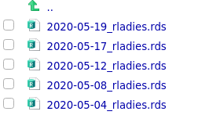

```{r setup, include=FALSE}
knitr::opts_chunk$set(echo = TRUE)
knitr::opts_chunk$set(cache = TRUE)
knitr::opts_chunk$set(fig.showtext = TRUE)
options(htmltools.dir.version = FALSE)
library(xaringanthemer)
library(twinetverse)
library(lubridate)
library(tidyverse)
library(tidytext)
library(dplyr)
library(forcats)
library(ggplot2) 
  theme_set(theme_linedraw())
library(graphTweets)
library(igraph)
library(opencage)
library(purrr)
library(RColorBrewer)
library(readr)
library(rnaturalearth)
library(rtweet)
library(sf)
library(stringr)
library(tidyr)
library(visNetwork)
library(here)
library(plotly)
library(kableExtra)
library(gt)
library(stopwords)
#library(webshot)
library(htmlwidgets)
library(wordcloud2)

```


```{r xaringan-themer, include=FALSE}

style_duo_accent(
  #primary_color = "#1381B0",
  #secondary_color = "#FF961C",
  inverse_header_color = "#FFFFFF",
  primary_color = "#035AA6",        # blue
  secondary_color = "#03A696",      # sea green
  header_font_google = google_font("Amatic SC"),
  text_font_google = google_font("Crete Round"),
  header_h1_font_size = "3.5rem",
  header_h2_font_size = "2.75rem",
  code_font_size = "0.7rem",
  text_font_size = "0.9rem"
)
```

# Contenido
- ¿Para qué sirven los datos de Twitter?
- Características de los datos generados con Twitter
- La librería `rtweet`
  - Configuración
  - Muestreo y recuperación de tweets
- Ejemplo: #RLadies
  - La red de Twitter de RLadies
  - Una mirada al contenido de los tweets
- Reflexiones finales

---
## El poder de Twitter

.center[]

https://datareportal.com/reports/digital-2020-global-digital-overview

---
## Detección de eventos 

.center[]

https://www.nature.com/articles/s41598-019-54388-4

---
## Covid-19

.center[]

https://www.arcgis.com/apps/opsdashboard/index.html#/abb41818160d4cec91f604520a088349
---

## Comunidades digitales

http://www.barriblog.com/

.center[]

 
---

## Monitoreo de servicios públicos

.center[]


---
# Los datos de Twitter

.pull-left[
### Ventajas
+ API de Twitter es abierta
+ Convención de uso de **#**
+ Longitud limitada del texto
]

.pull-right[
### Desventajas
- Límites <sup>*</sup>  en el número de tweets
    - Últimos 7 días
    - Máximo 18000
- Límites <sup>*</sup> en línea de tiempo
    - Máximo 3200
- No se tiene control sobre el muestreo
- Información geográfica deficiente
]
.footnote[[*] Para el API estándar]
---
class: inverse, center, middle

# La librería `rtweet`


---


# Panorama de `rtweet`: 

- Búsqueda: `search_tweets()`
- Consulta en vivo: `stream_tweets()` 
- Lineas de tiempo: `get_timeline()`
- Obtenga seguidores: `get_followers()`
- Obtenga amigos: `get_friends()`
- Obtenga favoritos: `get_favorites()`
- Obtenga tendencias: `get_trends()`
- Buscar usuarios: `get_users()`

y casi cualquier cosa que uno puede hacer con Twitter


  https://rtweet.info/index.html
---

## Anatomía de un tweet


---

```{r, include=FALSE}
tweets_vivo <- readRDS("data_vivo/tweets_vivo.rds")
```


```{r}
names(tweets_vivo)
```

---

# Componentes

.pull-left[

- user_id
- screen_name
- status_id
- created_at
- text
- lang
]
.pull-rigth[
- favorite_count
- retweet_count
- is_retweet
- geo_coords
- hashtags
- mentions_user_id
]

---

## Configurar el API del tweeter 

- Es necesario tener una cuenta de Twitter 
- Tener instalado `rtweet` y `httpuv`
- La autorización se realiza la primera vez que se ejecuta uno de los
comandos `search_tweets`, `get_time_line`, `get_followers`, etc.
- Solo para algunas aplicaciones avanzadas se requiere crear una app en Twitter


---
## Consulta

Así se consulta una vez:

```{r, eval=FALSE}
rladies <- search_tweets2("#Rladies", n = 18000)

write_rds(rladies, path = file.path("data_rladies", 
                                    paste0(Sys.Date(), "_rladies.rds")))
```

Y esto lo repetimos cada tres o cuatro días hasta obtener la muestra deseada:
]

---

## Recopilación

Función para leer y compilar los archivos<sup>*</sup>:

```{r}

lea_mas_fecha_colec <- function(RDS_file, patron_div_fecha, RDS_dir) {
  RDS_filename <- gsub(RDS_file, pattern = paste0(RDS_dir, "/"), replacement ="")
  RDS_fecha <- gsub(RDS_filename, pattern = patron_div_fecha, replacement = "") 
  readRDS(RDS_file) %>%
    mutate(harvest_date = as.Date(RDS_fecha))
}

```

Configuramos los parámetros de la función:

```{r}
# Obtenga la lista de archivos a compilar
RDS_file_rladies <- grep(list.files(here("data_rladies"), full.names = TRUE),
                               pattern = "rladies",
                               value = TRUE)
# Patrón del nombre:
patron_div_fecha_rladies <- "_rladies.rds"

# Directorio
RDS_dir_name_rladies <- here("data_rladies")

```
.footnote[[*] Tomado de https://marionlouveaux.fr/blog/Twitter-analysis-part1/]
---

Y aplicamos la función para unir todos los datos y quedarme solo con los
registros únicos:

```{r}

todas_rladies <- pmap_df(list(RDS_file_rladies,
                               patron_div_fecha_rladies,
                               RDS_dir_name_rladies), lea_mas_fecha_colec)

todas_rladies_uni <- todas_rladies %>%   #<<
  arrange(desc(harvest_date)) %>%        
  distinct(status_id, .keep_all = TRUE)  

```

---

## La base de datos

```{r}

vieja <- todas_rladies_uni %>%
arrange(desc(created_at)) %>%
slice(n()) %>%
pull(created_at)

nueva <- todas_rladies_uni %>%
arrange(desc(created_at)) %>%
slice(1L)  %>%
pull(created_at)


# Cuantos tweets hay en la base de datos
ntweets <- nrow(todas_rladies_uni)
  
# Cuantos dias hay en el registro 
ndias <-as.numeric(nueva -vieja)

# Número promedio de twets por dia
statusPorDia <- nrow(todas_rladies_uni)/ndias


```
- El registro recuperado tiene un total de `r ntweets ` tweets
- Va desde el `r day(vieja)` de `r month(vieja,label=TRUE,abbr = FALSE)` hasta 
`r day(nueva)` de`r month(nueva,label=TRUE,abbr = FALSE)` del `r year(nueva)`. 
- El número promedio de tweets por día es `r round(statusPorDia,0)`
---


## Usuarios diferentes totales y tweets originales

```{r}
total_usua <- todas_rladies_uni %>%
  pull(screen_name) %>%
  unique() %>%
  length()


total_tweet_number <- todas_rladies_uni %>% 
  filter(!is_retweet) %>% 
  pull(status_id) %>% 
  unique() %>% 
  length()

```


* Hay `r total_usua` usuarios diferentes en la base de datos
* El número total de tweets originales es `r total_tweet_number`

---
class: center, middle, inverse

# Ejemplo: La comunidad en Twitter 


---

## Dinámica temporal

```{r, fig.height = 4.6}

todas_rladies_uni <- todas_rladies_uni %>% 
        mutate (created_at=as_datetime(created_at))
  
ggplot(todas_rladies_uni,aes(x = created_at)) +
  geom_histogram(position = "identity", bins = 20, show.legend = FALSE) +
  labs(x = "Fecha", y = "Número de tweets") +
  theme_xaringan()


```

---

¿En cuáles días hay más actividad en Rladies?

```{r}
dias <-table(weekdays(todas_rladies_uni$created_at))

kable(sort(dias,decreasing =TRUE),col.names = c("Día","Frecuencia")) 
  
```

---

## Top 10: tweets

```{r}
top_contributors <- todas_rladies_uni %>%
  filter(!is_retweet) %>%
  count(screen_name) %>%
  arrange(desc(n)) %>%
  top_n(10)

```

.pull-left[

```{r, echo = FALSE}
top_contributors %>%
  slice(1:5) %>%
  gt() %>% 
  cols_label(screen_name = "Usuario",
            n = "Número")  

```
]

.pull-right[

```{r, echo = FALSE}
top_contributors %>%
  slice(6:10) %>%
  gt() %>% 
  cols_label(screen_name = "Usuario",
            n = "Número") 

```
]
---

## Top 10: retweets

```{r}
top_contributors_retweet <- todas_rladies_uni %>%
  filter(is_retweet) %>%
  count(screen_name) %>%
  arrange(desc(n)) %>%
  top_n(10)

```
.pull-left[

```{r, echo = FALSE}
top_contributors_retweet %>%
  slice(1:5) %>%
  gt() %>% 
  cols_label(screen_name = "Usuario",
            n = "Número")  

```
]

.pull-right[

```{r, echo = FALSE}
top_contributors_retweet %>%
  slice(6:10) %>%
  gt() %>% 
  cols_label(screen_name = "Usuario",
            n = "Número") 

```
]
---

## Tweets más populares

```{r}

mas_retweeted <- todas_rladies_uni %>% 
  filter(is_retweet == FALSE) %>% 
  arrange(desc(retweet_count)) 

mas_retweeted %>% 
  select(status_id, created_at, screen_name, retweet_count, favorite_count) %>% 
  head(5) %>% 
  gt()

```

---
## ¿Cuál fue el tweet más popular?

```{r, eval = FALSE}
mas_foto <- tweet_shot(statusid_or_url = mas_retweeted$status_id[1])
mas_foto
image_write(mas_foto, "tweet_pop.png")
```

---


  
---
# Redes de Twitter en R


---

# Tipos de redes
.pull-left[
- Conversaciones entre usuarios 
- Co-menciones de usuarios o hashtags
- **Retweets**
]

.pull-right[
      
]


---
## La red de Twitter de #Rladies 

Construcción de la red:

```{r}
net <- todas_rladies_uni %>%
  filter(is_retweet == TRUE) %>%
  gt_edges(screen_name, retweet_screen_name) %>%
  gt_nodes() %>%
  gt_collect()

```

Extraemos las aristas o lados:

```{r}
aristas <- net$edges
tail(aristas,5)
  
```

---
Extraemos las vértices o nodos:

```{r}
nodos <- net$nodes
tail(nodos,5)
  
```

Los convertimos a un formato que `sigmajs` entienda:

```{r}
nodos <- nodes2sg(nodos)
aristas <- edges2sg(aristas)

```

---

## Graficamos

```{r, results= "hold"}

grafo_plot <- sigmajs() %>% 
  sg_nodes(nodos, id, label, size) %>% 
  sg_edges(aristas, id, source, target) %>% 
  sg_layout(layout = igraph::layout_nicely) %>%
  sg_cluster(
    colors = c(
      "#0084b4",
      "#00aced",
      "#1dcaff",
      "#c0deed"
    )
  ) %>%
  sg_settings(
    minNodeSize = 1,
    maxNodeSize = 5.0,
    edgeColor = "default",
    defaultEdgeColor = "#d3d3d3",
    labelThreshold = 3
  ) %>% 
  sg_neighbours()

```

---

```{r}
grafo_plot
```

---
class: center, middle, inverse

# Exploración del contenido

---
## Primeros Pasos

1. Remover *stop words* 
1. Descomponer en palabras (*tokenizar*)
1. Calcular la frecuencia de palabras

---

## 1. Remover *stop words*

- Incluimos las del español y las de inglés, ya que ambos lenguajes se usan en 
nuestra base de datos.
- Excluimos también #rladies
- Ejemplos:

```{r}
head(stopwords("es"))
head(stopwords("en"))     
lista_stopwords <-c(stopwords("es"),stopwords("en"),"#rladies")

```

---

## 2. Descomponer en palabras

Esta sección se basa en el uso de la función `unnest_tokens` del paquete 
`tidytext`. 

```{r, warning = FALSE, message = FALSE }
# Remover caracteres "indeseables"
remove_reg <- "&amp;|&lt;|&gt;"

tidy_tweets <- todas_rladies_uni %>%
  # ignorar retweets
  filter(!str_detect(text, "^RT")) %>%
  mutate(text = str_remove_all(text, remove_reg)) %>%
  # token = "tweets" permite preservar caracters comunes en tweets
  unnest_tokens(word, text, token = "tweets") %>%
  filter(!word %in% lista_stopwords,
         !word %in% str_remove_all(lista_stopwords, "'"),
         str_detect(word,"[a-z]"))

```

---
Veamos el resultado con el primer tweet:

```{r}
head(todas_rladies_uni$text,1)
```

y su correspondiente descomposición:

```{r}
head(tidy_tweets$word,5)
```

---
## 3. Frecuencia de palabras

```{r}

frequency <- tidy_tweets %>%
  count(word, sort = TRUE) 

head(frequency,10) %>% 
  gt()


```

---

## Visualmente

```{r, fig.height=4.5, fig.width = 7}
freq_palabras <- frequency %>% 
    filter(n>80) %>% 
    ggplot(aes(x =reorder(word,n) , y = n)) +
    geom_col() +
    theme_bw() +
    labs(y = "", x = "") +
    theme(legend.position = "none") +
    coord_flip() +
    theme_xaringan()

```

---

```{r}
freq_palabras
```

---

## Nube de palabras

Usamos el paquete `wordcloud2`: 

```{r, nube_palabras}
freq20p <-frequency[frequency$n >=20,]
nube <- wordcloud2(freq20p,size = 0.7,shape="star")
```

---
```{r }
nube
```

---
## Referencias principales

Amat Rodrigo, Joaquín (2017). "Text mining con R: ejemplo práctico Twitter". Recuperado de https://rpubs.com/Joaquin_AR/334526

Coene, Jhon (2019). "The twinetverse: Visualise Networks of Twitter Interactions". https://twinetbook.john-coene.com/

Kearney MW (2019). “rtweet: Collecting and analyzing Twitter data.” Journal of Open Source Software, 4(42), 1829. doi: 10.21105/joss.01829, R package version 0.7.0, https://joss.theoj.org/papers/10.21105/joss.01829.

Louveaux M. (2020, Mar. 24). "Analysing Twitter data with R". Recuperado de https://marionlouveaux.fr/blog/Twitter-analysis-part1/.

Silge Julia and David Robinson (2020). Text Mining with R: A tidy approach. https://www.tidytextmining.com/

Vivek Sowmya and Vivek Vijayaraghavan (2020).  "Analyzing Social Media Data in R". Data Camp Course.

---

# Reflexiones finales

- Los datos generados por Twitter poseen muchas aplicaciones potenciales.
- Gracias a la comunidad abierta de R contamos con muchos recursos que nos 
permiten construir análisis de forma rápida y efectiva. 
- Muchos otros análisis se pueden realizar a partir de esta base:
    - Análisis de Sentimientos
    - Cartografía de los tweets (`opencage`)
    - Análisis detallados de la red
    - Modelado de tópicos o temas

---
class: center, middle, inverse
# ¡ Muchas gracias !
## ¿ Preguntas ?
